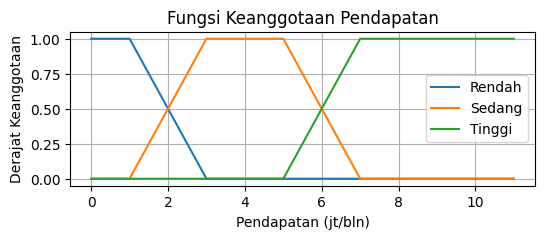
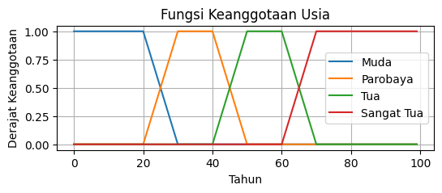
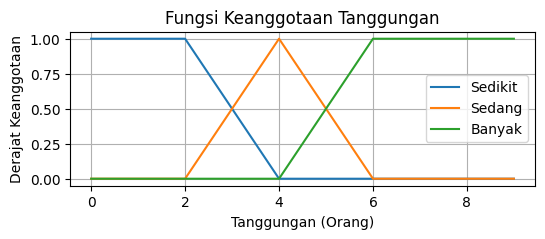
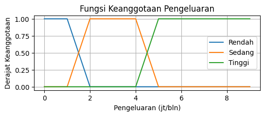
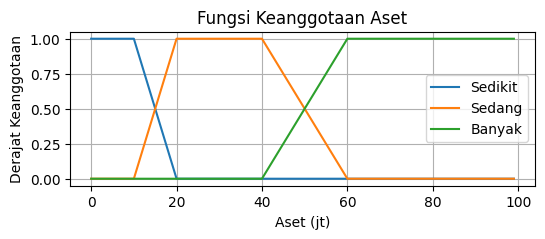
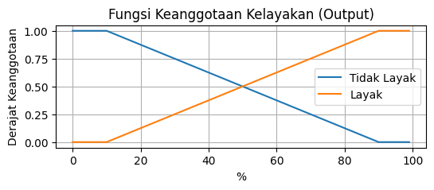

# Sistem Pendukung Keputusan (SPK) untuk kelayakan pemberian pinjaman menggunakan metode Fuzzy Tsukamoto

| Input Variable    | Linguistik                      | Semesta Pembicaraan       |
| ----------------- | ------------------------------- | ------------------------- |
| Pendapatan        | rendah, sedang, tinggi          | [0, 3, 7, 12...] jt/Bln   |
| Usia              | muda, parobaya, tua, sangat tua | [0, 30, 50, 100...] Tahun |
| Jumlah Tanggungan | sedikit, sedang, banyak         | [0, 2, 3, 10...] Orang    |
| Pengluaran        | rendah, sedang, tinggi          | [0, 1, 3, 10...] jt/Bln   |
| Nilai aset        | sedikit, sedang, banyak         | [0, 10, 40, 100] jt       |

 

| Output Variable | Linguistik         | Semesta Pembicaraan |
| --------------- | ------------------ | ------------------- |
| Kelayakan       | tidak layak, layak | [0, 40, 100...]%    |

# Fungsi Keanggotaan

<b>Fungsi Keanggotaan Pendapatan</b>

| rendah(x) | sedang(x) | tinggi(x) |
|--------|--------|--------|
| \begin{cases} 1, & x \leq 1 \\ \frac{3 - x}{3 - 1}, & 1 < x < 3 \\ 0, & x \geq 3 \end{cases} | \begin{cases} 0, & x \leq 1 \text{ atau } x \geq 7 \\ \frac{x - 1}{3 - 1}, & 1 < x < 3 \\ 1, & 3 \leq x \leq 5 \\ \frac{7 - x}{7 - 5}, & 5 < x < 7 \end{cases} | \begin{cases} 0, & x \leq 5 \\ \frac{x - 5}{7 - 5}, & 5 < x < 7 \\ 1, & x \geq 7 \end{cases}

\[
f(x) = 
\begin{cases} 
1, & \text{if } x \leq 1 \\
\frac{3 - x}{3 - 1}, & \text{if } 1 < x < 3 \\
0, & \text{if } x \geq 3 
\end{cases}
\]

 

<b>Fungsi Keanggotaan Usia</b>

| muda(x)                                                                                        | parobaya(x)                                                                                                                                                        | tua(x)                                                                                                                                                             | sangat tua(x)                                                                                  |
| ---------------------------------------------------------------------------------------------- | ------------------------------------------------------------------------------------------------------------------------------------------------------------------ | ------------------------------------------------------------------------------------------------------------------------------------------------------------------ | ---------------------------------------------------------------------------------------------- |
| \begin{cases} 1, & x \leq 20 \\ \frac{30 - x}{10}, & 20 < x < 30 \\ 0, & x \geq 30 \end{cases} | \begin{cases} 0, & x \leq 20 \text{ atau } x \geq 50 \\ \frac{x - 20}{10}, & 20 < x < 30 \\ 1, & 30 \leq x \leq 40 \\ \frac{50 - x}{10}, & 40 < x < 50 \end{cases} | \begin{cases} 0, & x \leq 40 \text{ atau } x \geq 70 \\ \frac{x - 40}{10}, & 40 < x < 50 \\ 1, & 50 \leq x \leq 60 \\ \frac{70 - x}{10}, & 60 < x < 70 \end{cases} | \begin{cases} 0, & x \leq 60 \\ \frac{x - 60}{10}, & 60 < x < 70 \\ 1, & x \geq 70 \end{cases} |

 

<b>Fungsi Keanggotaan Tanggungan</b>

| sedikit(x)                                                                               | sedang(x)                                                                                                                                    | banyak(x)                                                                                |
| ---------------------------------------------------------------------------------------- | -------------------------------------------------------------------------------------------------------------------------------------------- | ---------------------------------------------------------------------------------------- |
| \begin{cases} 1, & x \leq 2 \\ \frac{4 - x}{2}, & 2 < x < 4 \\ 0, & x \geq 4 \end{cases} | \begin{cases} 0, & x \leq 2 \text{ atau } x \geq 6 \\ \frac{x - 2}{2}, & 2 < x < 4 \\ 1, & x = 4 \\ \frac{6 - x}{2}, & 4 < x < 6 \end{cases} | \begin{cases} 0, & x \leq 4 \\ \frac{x - 4}{2}, & 4 < x < 6 \\ 1, & x \geq 6 \end{cases} |

 

<b>Fungsi Keanggotaan Pengeluaran</b>

| rendah(x)                                                                                    | sedang(x)                                                                                                                                                      | tinggi(x)                                                                                    |
| -------------------------------------------------------------------------------------------- | -------------------------------------------------------------------------------------------------------------------------------------------------------------- | -------------------------------------------------------------------------------------------- |
| \begin{cases} 1, & x \leq 1 \\ \frac{2 - x}{2 - 1}, & 1 < x < 2 \\ 0, & x \geq 2 \end{cases} | \begin{cases} 0, & x \leq 1 \text{ atau } x \geq 5 \\ \frac{x - 1}{2 - 1}, & 1 < x < 2 \\ 1, & 2 \leq x \leq 4 \\ \frac{5 - x}{5 - 4}, & 4 < x < 5 \end{cases} | \begin{cases} 0, & x \leq 4 \\ \frac{x - 4}{5 - 4}, & 4 < x < 5 \\ 1, & x \geq 5 \end{cases} |

 

<b>Fungsi Keanggotaan Aset</b>

| sedikit(x)                                                                                          | sedang(x)                                                                                                                                                                    | banyak(x)                                                                                           |
| --------------------------------------------------------------------------------------------------- | ---------------------------------------------------------------------------------------------------------------------------------------------------------------------------- | --------------------------------------------------------------------------------------------------- |
| \begin{cases} 1, & x \leq 10 \\ \frac{20 - x}{20 - 10}, & 10 < x < 20 \\ 0, & x \geq 20 \end{cases} | \begin{cases} 0, & x \leq 10 \text{ atau } x \geq 60 \\ \frac{x - 10}{20 - 10}, & 10 < x < 20 \\ 1, & 20 \leq x \leq 40 \\ \frac{60 - x}{60 - 40}, & 40 < x < 60 \end{cases} | \begin{cases} 0, & x \leq 40 \\ \frac{x - 40}{60 - 40}, & 40 < x < 60 \\ 1, & x \geq 60 \end{cases} |

 

<b>Fungsi Keanggotaan Kelayakan (Output)</b>

| tidak layak(x)                                                                                      | layak(x)                                                                                            |
| --------------------------------------------------------------------------------------------------- | --------------------------------------------------------------------------------------------------- |
| \begin{cases} 1, & x \leq 10 \\ \frac{90 - x}{90 - 10}, & 10 < x < 90 \\ 0, & x \geq 90 \end{cases} | \begin{cases} 0, & x \leq 10 \\ \frac{x - 10}{90 - 10}, & 10 < x < 90 \\ 1, & x \geq 90 \end{cases} |

 
